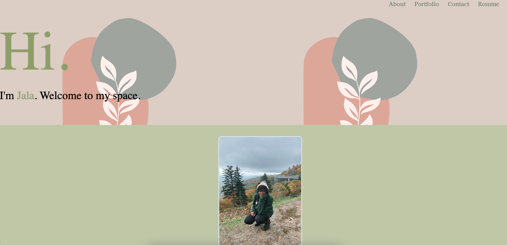

# React Portfolio
### Description
For this challenge, my goal was to build a single page portfolio using React.js. I used Bootstrap for page styling, and deployed using GitHub pages.

## Visuals 

## Future Implementations 
This project still needs minor tweaks -- changes are being made to the portfolio cards and the footer.

## Resources 
 * [Repository](https://github.com/untjala/react-portfolio)
 * [GitHub Pages](https://untjala.github.io/react-portfolio/)

## Contact
Questions? Ideas? Contributions? Feel free to reach or check out some of my other projects at: **https://github.com/untjala**